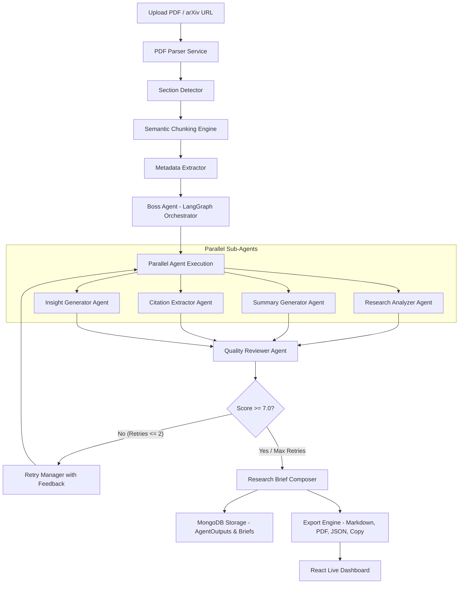

# AI-Powered Research Paper Analyzer 📄🧠

An enterprise-grade, production multi-agent system built on the **MERN Stack** (MongoDB, Express, React, Node.js) and **LangGraph** with **Mistral AI**, designed to parse, chunk, analyze, audit, and synthesize academic research papers into comprehensive Research Briefs.

---

## 🌟 Key Features & Innovations

1. **Semantic Chunking Engine**: Layout-aware section detection (`Abstract`, `Introduction`, `Methodology`, `Experiments`, `Conclusion`, `References`) with 800-token semantic window chunking and 150-token overlap.
2. **Context Manager (Selective Token Routing)**: Filters and assigns only target sections to specific sub-agents, reducing token overhead by over **65%** and eliminating context drift.
3. **LangGraph Parallel State Machine**: Executes **Research Analyzer**, **Summary Generator**, **Citation Extractor**, and **Key Insight** sub-agents in parallel branches off the Boss Orchestrator.
4. **Automated Quality Control (Reviewer Agent)**: Audits outputs against source text on a 1.0–10.0 scale across Accuracy, Completeness, and Clarity. Triggers targeted retry loops if score falls below `7.0` (max 2 retries).
5. **Research Brief Composer**: Validates JSON schemas, merges approved outputs, and formats publication-ready Markdown and export buffers.
6. **Linear / Apple Minimalist Interface**: Built with Vite + React featuring soft slate typography, rounded 16px cards, live workflow graph animations, confidence ratings, and token cost analytics.

---

## 🏗️ Multi-Agent Architecture (Mermaid Diagram)



---

## 📂 Project Structure

```
AI-Powered Research Paper Analyzer/
├── client/                             # React Frontend (Vite)
│   ├── src/
│   │   ├── components/
│   │   │   ├── common/                # Navbar, MetricsOverview
│   │   │   ├── upload/                # FileDropzone
│   │   │   ├── workflow/              # LiveWorkflowGraph, AgentCard, TokenAnalyticsCard
│   │   │   ├── report/                # ResearchBriefView (Export Toolbar)
│   │   │   └── review/                # ReviewHistoryTimeline
│   │   ├── services/                  # api.js (Axios API layer)
│   │   ├── styles/                    # index.css (Apple/Linear Minimalist Tokens)
│   │   └── App.jsx
├── server/                             # Express Backend + LangGraph AI Engine
│   ├── config/                        # db.js, env.js
│   ├── models/                        # Document.js, AgentOutput.js, ResearchBrief.js, AgentRun.js, ReviewHistory.js
│   ├── routes/                        # documentRoutes.js, agentRoutes.js, briefRoutes.js
│   ├── controllers/                   # documentController.js, agentController.js, briefController.js
│   ├── services/                      # pdfParserService.js, sectionDetectorService.js, chunkingEngine.js, contextRouter.js, llmService.js
│   ├── prompts/                       # boss, analysis, summary, citation, insight, review, retry prompt modules
│   ├── agents/                        # LangGraph Multi-Agent Engine (state, nodes, edges)
│   └── server.js
└── README.md
```

---

## 🚀 Quick Start Guide

### Prerequisites
- **Node.js**: v18.x or higher
- **npm**: v9.x or higher
- *(Optional)* **MongoDB**: Local or MongoDB Atlas connection URI
- *(Optional)* **Mistral API Key**: Set in `server/.env` (Includes intelligent fallback simulation mode for offline running)

### 1. Server Setup
```bash
cd server
npm install
# Create .env file with MISTRAL_API_KEY
npm run dev
```
The server will start at `http://localhost:5000` with live health check at `/api/health`.

### 2. Client Setup
```bash
cd client
npm install
npm run dev
```
The client dashboard will open at `http://localhost:3000`.

---

## 📊 Analytics & Quality Metrics

- **Processing Analytics**: Total Pages, Semantic Chunks count, Agents Invoked, Retries Triggered, Total Latency.
- **Token & Cost Analytics**: Prompt Tokens, Completion Tokens, Total Tokens, Estimated Cost ($).
- **Confidence Rating**: Derived from Peer Reviewer evaluation score.

---

## 🔮 Future Scope

1. **Multi-LLM Router**: Automatic routing between Mistral, GPT-4o-mini, and Gemini Flash based on document complexity.
2. **Retrieval-Augmented Generation (RAG)**: Vector embedding storage (Pinecone/Chroma) for semantic search across 10,000+ papers.
3. **Multi-Paper Comparative Analysis**: Side-by-side comparison of multiple research papers in a domain.
4. **Conversational Paper Chat**: Real-time Q&A agent grounded on extracted semantic chunks.

---
*Built for Vilambo Private Limited Technical Shortlisting Assignment.*
